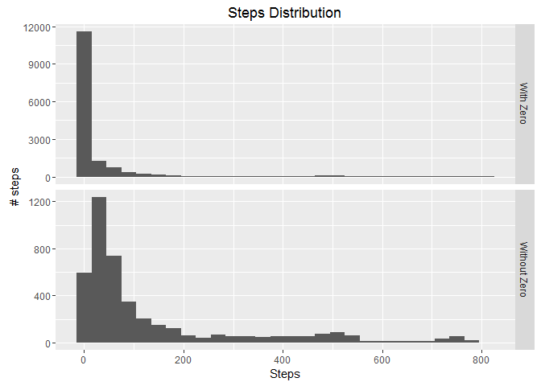
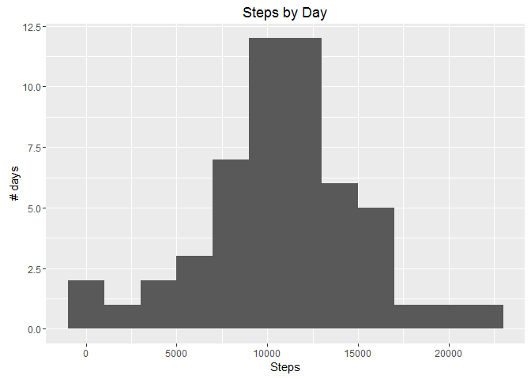
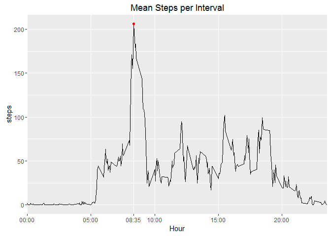
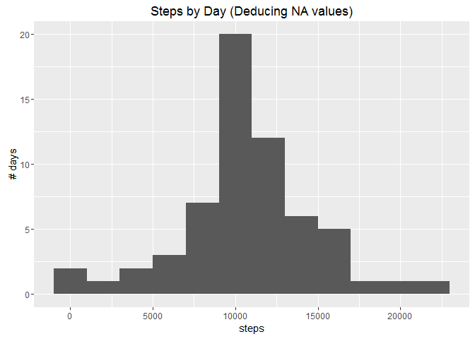
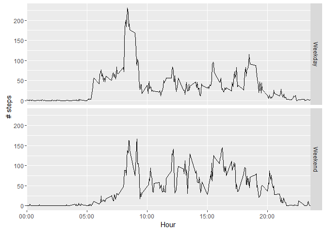

Load and process data
---------------------

We will analyze the data set "Activity monitoring data"" (amdata) that contains data at 5 minute intervals from an anonymous individual collected during the months of October and November, 2012 and include the number of steps taken in 5 minute intervals each day.

``` r
unzip("activity.zip")
amdata <- read.csv('activity.csv')
completeAmData <- amdata[complete.cases(amdata$steps),]

qtyNA <- sum(is.na(amdata$steps))
pNA <- qtyNA / nrow(amdata)
qtyZero <- sum(completeAmData$steps == 0)
pZero <- qtyZero / nrow(amdata)
```

The data set contains both NA and zero values in the step colums:
*Number of NA:* 2304 (0.13%)
*Number of Zero:* 11014 (0.63%)

To better understand the distribution of steps we will generate two histograms, specially because of the high number of both NA and zero values.



Steps by day
------------

To better understand the behaviour of the individual, we can also analyze the distribution of the sum of steps by day.



Summary:
*Mean:* 10766.19
*Median:* 10765



Summary of Mean Steps per Day:
Maximum 206.1698 steps at 835 interval

Analyzing NA values
-------------------

The data set contains 2304 lines with empty value for the steps.

This values will be deduced using the "mean step by interval" above. Every row that contains a NA at the step column will be equal to the mean step count of that interval.

For this we will use the Coalesce method, that will always choose the first non-NA, non-NULL value in the order specified.

``` r
filledData <- amdata
filledData$steps <- coalesce(filledData$steps,
  as.integer(
    left_join(filledData, meanStepsByInterval, by = 'interval')$steps.y))
```

With this transformation, the data set now contains the following histogram.



Summary of Steps by Day (Deducing NA values):
*Mean:* 10749.77
*Median:* 10641

Comparing the impact
--------------------

We can compare the impact of the change had comparing the mean and the median statistics before and after the modification:

*Mean*
- Before: 10766.19
- After: 10749.77
*Median*
- Before: 10765
- After: 10641

Analysis on Weekends
--------------------

To better understand the individual we can also analyze his behaviour comparing the quantity of steps monitored on weekdays and on weekends.


